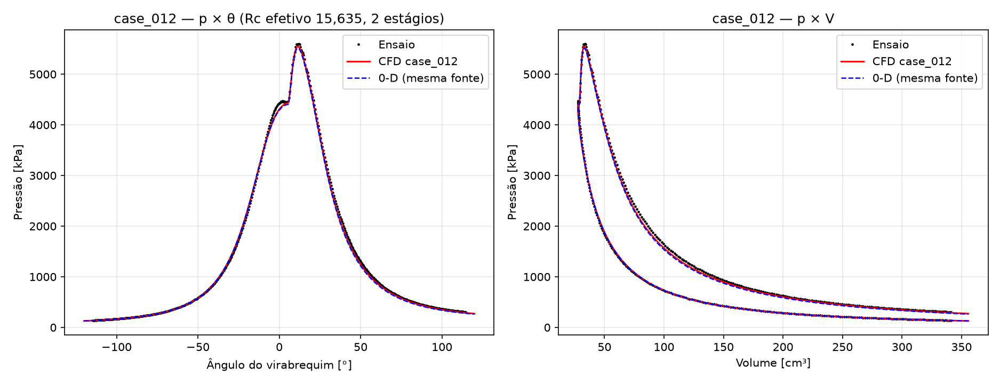
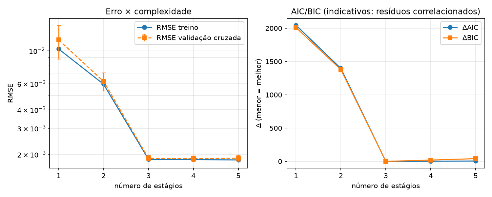
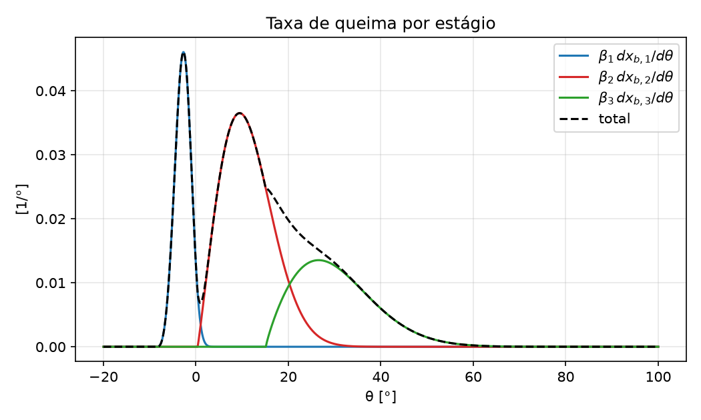

# wiebepy — funções Wiebe de 1 a 5 estágios

Ferramenta científica em Python para modelar, avaliar, ajustar e comparar
funções Wiebe **single, double, triple, 4- e 5-stage**: fração de massa
queimada $x_b(\theta)$, taxa de queima $dx_b/d\theta$ (derivada analítica),
ajuste a dados experimentais por PSO com refinamento local, múltiplos runs
com estatística, comparação objetiva entre números de estágios (AIC/BIC +
validação cruzada por blocos), diagnóstico de identificabilidade e execução
serial, paralela em CPU ou em GPU NVIDIA.

O **núcleo** trabalha só com a função Wiebe e com dados $(\theta, x_b)$ e/ou
$(\theta, dx_b/d\theta)$, sem qualquer modelo termodinâmico. Dois módulos
**opcionais** estendem isso sem alterar o núcleo:

- **modo pressão** (0-D): ajusta N estágios à curva de pressão do cilindro
  com modelo de zona única (Hohenberg) — §"Modo pressão" abaixo;
- **CFD** (OpenFOAM 13): escoamento compressível com liberação de calor
  prescrita pela Wiebe calibrada — §"CFD" abaixo.

> 📖 Guia passo a passo: abra [`Help.html`](Help.html) no navegador.
> Ajuda na linha de comando: `wiebepy --help`, `wiebepy --help-model`,
> `wiebepy --help-examples`.

## Sumário

1. [Instalação](#1-instalação)
2. [Formulação matemática](#2-formulação-matemática)
3. [Parâmetros](#3-parâmetros)
4. [Linha de comando](#4-linha-de-comando)
5. [API Python](#5-api-python) · [Interface gráfica](#interface-gráfica)
6. [Otimização](#6-otimização)
7. [Comparação entre números de estágios](#7-comparação-entre-números-de-estágios)
8. [Execução paralela e GPU](#8-execução-paralela-e-gpu)
9. [Formatos de entrada e saída](#9-formatos-de-entrada-e-saída)
10. [Validação e testes](#10-validação-e-testes)
11. [Benchmark](#11-benchmark)
12. [Estrutura do projeto](#12-estrutura-do-projeto)
13. [Limitações conhecidas](#13-limitações-conhecidas)
14. [Referências](#14-referências)

---

## 1. Instalação

Requer Python ≥ 3.11 (Windows, Linux ou WSL2).

```bash
git clone <url-do-repositório> wiebepy
cd wiebepy
python -m venv .venv
# Windows:            .venv\Scripts\activate
# Linux/macOS/WSL2:   source .venv/bin/activate
python -m pip install --upgrade pip
pip install -e ".[numba,gui,dev]"     # núcleo + Numba + interface + pytest
```

Extras opcionais — o programa funciona **sem nenhum deles**:

| Extra | Instala | Para |
|---|---|---|
| `numba` | `numba` | kernels compilados em CPU (o backend mais rápido em CPU) |
| `gpu` | `cupy-cuda12x` | GPU NVIDIA (requer driver CUDA 12+) |
| `gui` | `streamlit`, `altair`, `pandas` | interface gráfica (`wiebepy --gui`) |
| `cfd` | dependências do módulo CFD | subcomando `wiebepy cfd` (solver OpenFOAM 13 no WSL2 à parte; ver `docs/cfd/install.md`) |
| `dev` | `pytest` | testes |

Sem instalar o pacote, use `python main.py` no lugar de `wiebepy`.
Alternativa: `pip install -r requirements.txt`.

Verificação rápida:

```bash
wiebepy --devices          # hardware, Numba, CuPy/GPU e backends disponíveis
wiebepy --stages 3 --plot  # avalia e plota um triple-Wiebe padrão
python -m pytest           # suíte de testes
```

## 2. Formulação matemática

### Single-Wiebe

$$
x_b(\theta) =
\begin{cases}
0, & \theta < \theta_0 \\[2pt]
1 - \exp\!\left[-a\left(\dfrac{\theta-\theta_0}{\Delta\theta}\right)^{m+1}\right], & \theta \ge \theta_0
\end{cases}
$$

Com $a = 6.908 = \ln 1000$, 99.9 % da massa queima até $\theta_0 + \Delta\theta$.

### Multi-stage Wiebe (N = 1…5)

Para cada estágio $j$, com $z_j = (\theta - \theta_{0,j})/\Delta\theta_j$:

$$
x_{b}(\theta)=\sum_{j=1}^{N}\beta_j\left[1-\exp\!\left(-a_j\,z_j^{\,m_j+1}\right)\right]\mathbb{1}[\theta\ge\theta_{0,j}]
$$

$$
\frac{dx_b}{d\theta}=\sum_{j=1}^{N}\beta_j\,\frac{a_j(m_j+1)}{\Delta\theta_j}\,z_j^{\,m_j}\exp\!\left(-a_j\,z_j^{\,m_j+1}\right)\mathbb{1}[\theta\ge\theta_{0,j}]
$$

com $0 \le \beta_j \le 1$, $\sum_j \beta_j = 1$, $\Delta\theta_j > 0$,
$m_j > 0$, $a_j > 0$. Cada termo é monotônico em $[0, 1)$, logo
$0 \le x_b \le 1$ e $x_b$ é não decrescente; o código apenas recorta ruído
de ponto flutuante. $N = 2$ com $\beta_1 = \alpha$ é o double-Wiebe clássico.

**Uma única implementação**: `multistage_wiebe(theta, stages)` e
`multistage_wiebe_derivative(theta, stages)` (em `core/`) servem para
qualquer N — o número de estágios só determina o tamanho dos arrays; não
há `if stages == …` na física. O mesmo código roda em NumPy e CuPy (camada
`xp`).

## 3. Parâmetros

| Parâmetro | Símbolo | Unidade | Restrição |
|---|---|---|---|
| `beta` | $\beta_j$ | – | $[0,1]$, $\sum\beta_j=1$ |
| `theta0` | $\theta_{0,j}$ | ° (ou rad) | $\theta_{0,1}\le\dots\le\theta_{0,N}$ no ajuste |
| `duration` | $\Delta\theta_j$ | ° (ou rad) | $>0$ |
| `m` | $m_j$ | – | $>0$ (m pequeno: início abrupto) |
| `a` | $a_j$ | – | $>0$; padrão fixo 6.908 |

$\theta$, $\theta_0$ e $\Delta\theta$ usam a mesma unidade (graus por
padrão; `--angle-unit rad`); $dx_b/d\theta$ sai em 1/° (ou 1/rad).

## 4. Linha de comando

```bash
wiebepy --help            # descrição, parâmetros, unidades, backends, formatos
wiebepy --help-model      # formulação matemática e parametrização
wiebepy --help-examples   # comandos prontos (single … 5-stage, ajuste, GPU)
```

Exemplo rápido (avaliação):

```bash
wiebepy --stages 3 --theta-min -20 --theta-max 100 --theta-step 0.1 --plot
```

Ajuste e comparação:

```bash
wiebepy --stages 3 --optimize --input examples/data/synthetic_3stage.csv \
        --fit-target xb --runs 10 --save-plots --output results/fit3

wiebepy --compare-stages 1 2 3 4 5 --input experimental.csv --optimize \
        --population 100 --iterations 1000 --runs 20 \
        --backend auto --workers 8 --save-plots
```

| Opção | Efeito |
|---|---|
| `--stages N` | número de estágios (1–5) |
| `--compare-stages N …` | ajusta e compara vários N (requer `--input`) |
| `--theta-min/--theta-max/--theta-step` | grade do modo de avaliação |
| `--input ARQ` / `--output DIR` | dados / diretório de resultados |
| `--optimize`, `--optimizer pso` | ajuste aos dados |
| `--population`, `--iterations`, `--patience`, `--topology` | PSO (padrão 100 × 1000, paciência 200, anel) |
| `--runs R`, `--seed S` | runs independentes com sementes S, S+1, … |
| `--objective` | `rmse` \| `mse` \| `mae` \| `see` \| `wrmse` |
| `--fit-target` | `xb` \| `dxb` \| `both` (+ `--w-x`, `--w-d`) |
| `--a-fixed A`, `--fit-a` | eficiência fixa (6.908) ou ajustada |
| `--beta-param` | `stick` (padrão) \| `softmax` \| `explicit` |
| `--no-polish` | desliga o refinamento local |
| `--cv-folds K` | folds da validação cruzada (0 desliga) |
| `--backend`, `--workers`, `--gpu`, `--precision` | execução (ver §8) |
| `--model model.json` | avalia um modelo salvo |
| `--plot`, `--save-plots`, `--json` | gráficos na tela / PNG / results.json |
| `--config ARQ` | configuração JSON/YAML/TOML (a CLI prevalece) |
| `--benchmark`, `--benchmark-full`, `--devices` | utilidades |
| `--quiet`, `--verbose`, `--debug`, `--version` | mensagens |

Códigos de saída: 0 sucesso, 2 erro de uso/dados/configuração, 1 erro
inesperado. `--verbose` mostra hardware, backend e o progresso do PSO:

```
Mode              : optimize
Requested backend : auto
GPU               : NVIDIA GeForce RTX 4050 Laptop GPU
CPU workers       : 19
Number of stages  : 3
Optimization      : PSO (100 particles × 1000 iterations, 2 runs)
Precision         : float64
auto: numba=0.84 ms, cupy=1.67 ms, numpy=4.11 ms
Execution backend : numba (19 threads)
Run 01/02 | 3-Wiebe | iteration   50/1000 | best 1.039e-02 | 0.0 s
...
Run 01/02 | 3-Wiebe | iteration 1000/1000 | best 3.023e-03 | 0.5 s
Run 01/02  objetivo = 1.872461e-03  (1.2 s, iterations)
```

(o último valor é após o refinamento local: o PSO sozinho parou em 3.0e-3)

### Arquivo de configuração

```yaml
model:        {stages: 3, a_fixed: 6.908, beta_mode: stick}
optimization: {method: pso, particles: 100, iterations: 1000, runs: 10,
               objective: rmse, fit_target: xb}
bounds:       {m: [0.05, 5.0]}           # sobrescreve limites padrão
comparison:   {stages: [1, 2, 3, 4, 5], cv_folds: 5}
parallel:     {backend: auto, workers: 8, precision: float64}
output:       {directory: results, save_plots: true}
```

Exemplos em [`examples/`](examples/) (`.yaml`, `.json`, `.toml`).
Precedência: padrões < arquivo < CLI.

## 5. API Python

```python
import numpy as np
from wiebepy import MultiStageWiebe, multistage_wiebe, multistage_wiebe_derivative

theta = np.linspace(-20, 100, 1201)

model = MultiStageWiebe(n_stages=3)          # estágios padrão
xb = model.evaluate(theta)
dxb = model.derivative(theta)
contrib_x, contrib_d = model.contributions(theta)   # (N, n) cada

result = model.fit(theta_exp, xb_exp, optimizer="pso", backend="auto",
                   runs=10, seed=42)          # atualiza model.stages
print(result.stages, result.metrics["xb"], result.warnings)

model.save("model.json")
model = MultiStageWiebe.load("model.json")

# função pura, sem classe:
stages = [{"beta": 0.35, "theta0": -5.0, "duration": 12.0, "m": 2.0, "a": 6.908},
          {"beta": 0.65, "theta0": 2.0, "duration": 45.0, "m": 1.3, "a": 6.908}]
xb = multistage_wiebe(theta, stages)
```

### Interface gráfica

```bash
wiebepy --gui                          # abre no navegador (localhost:8501)
streamlit run src/wiebepy/gui/app.py   # equivalente
```

Páginas (menu no topo) e botão **Ajuda** (abre este guia, `Help.html`):

| Página | O que faz |
|---|---|
| Dados | carrega .csv/.txt/.dat/.json ou um exemplo sintético; métricas e gráficos dos dados |
| Modelo | escolhe N (1–5), edita β, θ0, Δθ, m, a numa tabela; x_b e dx_b/dθ com contribuições por estágio sobre os dados; baixa `model.json` |
| Ajuste | PSO + refinamento em segundo plano com **progresso ao vivo e cancelamento**; parâmetros, estatística dos runs, métricas, avisos, ajuste, resíduos e convergência; "aplicar ao modelo" |
| Comparação | ajusta vários N; tabela com CV, ΔAIC/ΔBIC, Durbin-Watson; recomendação; detalhe de cada N |
| Exportar | os mesmos arquivos da CLI num `.zip` (com gráficos PNG) |
| Desempenho | hardware detectado e benchmark rápido dos backends |
| CFD | página dedicada (opcional): configura o caso, prepara/valida/executa/cancela com log ao vivo, estados (Preparado/Validado/Executando/Concluído/Cancelado/Falhou), resultados p̄×θ e T̄×θ e relatório HTML — sem remover nenhuma página existente |

Na interface os runs rodam em sequência (para permitir progresso por
iteração e cancelamento); o paralelismo vem do backend (Numba multithread
ou GPU). Runs em processos paralelos continuam disponíveis na CLI.

### Modo pressão (curva de pressão do cilindro)

Com dados de ensaio θ × P, o wiebepy ajusta a **pressão** exatamente como o
Double Wiebe, mas com **1 a 5 estágios** de liberação de calor: mesmo modelo
0-D de zona única (geometria biela-manivela, Hohenberg, EDOs em P e T_g),
com $dQ/d\theta = Q_{total}\sum_j \beta_j\,dx_j/d\theta$. Rc é ajustado
por padrão (`--fixed-rc` para fixá-lo). **Com N = 2 o modelo reproduz o
Double Wiebe** (diferença ≤ 1e-6 relativa, testada).

```bash
wiebepy --stages 2 --optimize --input examples/data/ensaio_P_exp_carga3_45.txt \
        --input-type pressure --pressure-unit bar --runs 5 --save-plots
wiebepy --compare-stages 1 2 3 --input ensaio.txt --input-type pressure
```

Busca: PSO com o enxame integrado em lote por RK4 (Numba/CUDA/NumPy); cada
run é refinado por mínimos quadrados e **revalidado com solve_ivp**
(DOP853, 1e-9) — esse é o RMSE relatado. Motor e janela angular na
configuração (`engine:` aceita as chaves do YAML do Double Wiebe;
`pressure: {angle_unit, pressure_unit, theta_min_rad, theta_max_rad}`).
Na GUI: página Dados → Tipo de dado = **Pressão do cilindro**.

Ensaio real `P_exp-Carga-3_45%` (459 pontos, −2 a 2 rad), 4 runs:

| Modelo | RMSE [kPa] | R² | Rc |
|---|---:|---:|---:|
| 2 estágios (wiebepy) | 44.51 | 0.999195 | 15.63 |
| 3 estágios (wiebepy) | 42.82 | 0.999255 | 15.52 |
| Double Wiebe (melhor de 18 runs) | 47.68 | — | 15.51 |

Os domínios diferem: o Double Wiebe limita δ₁ ≤ 40° e penaliza a
sobreposição das fases; aqui cada estágio pode durar até 90° e a ordem é
imposta pelos incrementos. Com N = 3 surge o aviso θ0₂ ≈ θ0₃ (estágio
provavelmente supérfluo).

Arquivos de x_b com valores acima de 1.5 são recusados com a indicação de
usar o modo pressão.

**Relatório HTML completo** (`report.html`, gerado junto com os resultados na
CLI e pelo botão *Gerar relatório HTML* na GUI): arquivo único com o motor e
todas as constantes, os coeficientes do modelo (Hohenberg, balanço de
energia, integradores, coeficientes Wiebe de cada estágio e o vetor de
parâmetros ajustados com limites), a configuração do ajuste, as métricas,
indicadores termodinâmicos (P e T máximas, CA10/50/90, calores, trabalho
indicado e IMEP na janela), runs, avisos, a comparação (se houver) e os 10
gráficos (pressão, P–V linear e log-log, resíduo, taxa de liberação de calor
por estágio, fração queimada, taxa normalizada, temperatura, calor perdido e
volume).

### CFD (opcional — escoamento 3D com OpenFOAM)

Módulo **independente e opcional** (`pip install -e ".[cfd]"`; a física e
os fluxos acima não mudam nada com CFD ligado ou desligado): simulação 3D
compressível transiente do cilindro com **liberação de calor global
prescrita pela Wiebe calibrada** (modo *prescribed*), combustíveis H₂,
CH₄ (puro — não é gás natural), etanol e diesel (surrogate) — o caso de
teste/referência usa **Diesel**, combustível do ensaio de pressão que
originou o motor calibrado. **Não prevê
cinética química, frente de chama ou emissões.** Solver: OpenFOAM
Foundation 13 (`foamRun`, solver `fluid`), no Windows via WSL2 — o
programa continua 100 % utilizável sem WSL2/solver (sem fallback
silencioso). Detalhes de arquitetura e da fonte de calor conservativa:
`docs/cfd/architecture.md`; instalação: `docs/cfd/install.md`;
verificação executada (balanço de energia fecha em ±2 %):
`docs/cfd/verification.md`.

```bash
wiebepy cfd doctor                 # diagnóstico WSL2/OpenFOAM
wiebepy cfd prepare  --config examples/config_cfd.yaml   # sem executar
wiebepy cfd validate --case results/cfd/case_001
wiebepy cfd run      --case results/cfd/case_001 --follow
wiebepy cfd status   --case results/cfd/case_001   # cancel/status/report idem
wiebepy cfd report   --case results/cfd/case_001   # relatório HTML autônomo
```

#### Rodando um exemplo — caso de referência (case_006)

Para rodar um exemplo você só **edita um arquivo**; os outros dois são
referenciados por ele. Os 3 arquivos que entram em jogo:

| Arquivo | Papel | Você edita? |
|---|---|---|
| `examples/config_cfd_equivalencia.yaml` | Config do caso (motor + CFD) — é o único que o CLI recebe | Só se quiser um diretório novo — senão usa `--output` |
| `examples/model_cfd_calibrated.json` | Fonte Wiebe — já apontado dentro da config (`wiebe.model`) | Não |
| `examples/data/ensaio_P_exp_carga3_45.txt` | Ensaio experimental para o diagnóstico — já apontado (`comparison.experimental`) | Não |

A sequência (4 comandos + 1 verificação):

```bash
# 0. uma vez: confere WSL2 + OpenFOAM 13
wiebepy cfd doctor

# 1. gera o caso OpenFOAM para inspeção (NÃO executa)
wiebepy cfd prepare  --config examples/config_cfd_equivalencia.yaml \
    --output results/cfd/meu_caso

# 2. valida o caso gerado
wiebepy cfd validate --case results/cfd/meu_caso

# 3. executa (WSL2/OpenFOAM; ~2–3 min na malha 24×36)
wiebepy cfd run      --case results/cfd/meu_caso

# 4. relatório HTML com p×θ, p×V e comparação com o ensaio
wiebepy cfd report   --case results/cfd/meu_caso
```

O `--output` sobrescreve o `case_directory` da config — assim você não
toca em arquivo nenhum e não sobrescreve o case_006 arquivado.

O que cada comando produz:

- `prepare` → `results/cfd/meu_caso/` completo (`system/`, `constant/`,
  `0/`, `case_config.yaml` — este último registra TUDO: procedência da
  fonte, propriedades, energia, hipóteses); você pode inspecionar antes
  de rodar.
- `validate` → estado do caso vira VALIDATED (só caso validado executa —
  é o gate que já impediu erros de caminho no case_013).
- `run` → `logs/foamRun.log`, séries em `postProcessing/`, estado
  COMPLETED.
- `report` → `report.html` dentro do diretório do caso — é esse que você
  abre no navegador.

Variantes úteis sem editar arquivo:

- **Sem combustão (motored)**: acrescente `--no-heat` ao `prepare`.
- **Multicomponente (R1)**: precisa de config própria — copie
  `examples/config_cfd_multicomponent.yaml` (já tem
  `gas.model: multicomponent_inert`).
- **GUI**: `streamlit run src/wiebepy/gui/app.py` → aba CFD já abre
  casada com o case_006; os botões são os mesmos quatro passos.

Lembrete de leitura do resultado: o `report.html` compara com o ensaio
de forma **diagnóstica** (mesma rotação, mesma energia) — o que ele diz
é onde o modelo diverge do ensaio e por quê, não "o modelo foi
validado".

#### Rodando um exemplo na interface gráfica (GUI)

Abertura (requer `pip install -e ".[gui]"`):

```bash
wiebepy --gui                          # abre no navegador (localhost:8501)
streamlit run src/wiebepy/gui/app.py   # equivalente
```

Escolha a página **CFD** no menu lateral. O passo a passo, com os
botões na ordem:

1. **Verificar o ambiente** (uma vez): no expander *Diagnóstico do
   ambiente (doctor)*, botão **Executar diagnóstico** — equivale ao
   `wiebepy cfd doctor` (confere WSL2, OpenFOAM, foamRun, mpirun). Se
   a linha *Conexão* mostrar *nenhuma*, clique **Conectar OpenFOAM ao
   código**: verifica que o foamRun executa (probe `-help`), grava a
   conexão em `~/.wiebepy/cfd_env.json` e ajusta a *Distribuição
   WSL2* do formulário (primeiro na distro configurada; sem
   instalação lá, a melhor de qualquer distro). Equivalente na CLI:
   `wiebepy cfd doctor --connect`.
2. **Escolher o diretório do caso** — o primeiro ajuste de todo caso
   novo: em *Configuração do caso*, troque **"Diretório do caso"** para
   um diretório NOVO (ex.: `results/cfd/caso_gui_001`). ⚠️ O padrão
   aponta para o case_006 arquivado — clicar **Preparar caso** com esse
   diretório **sobrescreve** o caso arquivado.
3. **Conferir os campos** — eles já abrem casados com o case_006:
   fonte Wiebe em origem `model.json` = `examples/model_cfd_calibrated.json`
   (a calibrada; a manual é `model_cfd.json` — não use), Rc 17, janela
   −120…+120°, P 127,6 kPa / T 308,15 K, paredes 440 K, kEpsilon,
   pistão móvel, 24×36 células, distribuição `uniform`, combustível
   diesel, PCI 39191,3, rpm 3396,2. Confirme ainda:
   - **"Distribuição WSL2"** = `Ubuntu-22.04` (a distro do solver);
   - **"Processos MPI do SOLVER"** = 1 (paralelismo do solver, não do
     wiebepy);
   - **Estágios Wiebe**: com origem `model.json` o calor vem do arquivo
     calibrado; com origem *modelo atual* a tabela editável 1–5 estágios
     aparece (a edição NÃO altera o modelo 0-D).
   - **Gás, numérica e comparação** (equivalência completa com a CLI —
     mesmas chaves `cfd.gas`/`cfd.numerics`/`cfd.comparison`):
     *Modelo do gás* `simple` com Cp 1063,0 J/(kg·K) e M 28,96 ⇒
     γ=1,370 = κ do 0-D (o padrão antigo Cp 1005 ⇒ γ=1,400); `simple`
     também expõe μ e Pr; *max_Co* 0,25 (0,5 abortou neste motor,
     §5b do `verification.md`), Δt 1e-6 s, escrita a cada 10° CA; e o
     expander *Comparação com o ensaio (diagnóstica)* com o ensaio de
     referência (`examples/data/ensaio_P_exp_carga3_45.txt`, rad/bar,
     offset 0) — a sobreposição entra no `report.html`. Em
     *Modelo do gás* = `multicomponent_inert` (degrau R1) Cp/μ/Pr ficam
     desabilitados: N₂+O₂ com NASA janaf da mistura. Para descartar a
     comparação, esvazie o campo do arquivo.
4. **Preparar caso** → gera o caso OpenFOAM para inspeção (estado
   *Preparado*). A configuração é validada antes: erros aparecem como
   mensagem vermelha e o caso não é gerado.
5. **Validar** → estado *Validado* — o **Executar** exige isso (gate).
6. **Executar** → painel com o **log do solver ao vivo**; ~2–3 min na
   malha 24×36. **Cancelar execução** interrompe inclusive os processos
   MPI, preservando logs e resultados parciais.
7. **Relatório HTML** → gera/atualiza o `report.html` no diretório do
   caso (habilitado só no estado *Concluído*).
8. **Ver os resultados**: o expander *Resultados (0-D extraído do caso
   3D)* mostra p̄ máx, T̄ máx, trabalho indicado, perda nas paredes, a
   energia prescrita pela Wiebe com o erro da tabela, e o gráfico
   p̄×θ/T̄×θ. O relatório completo (proveniência, balanço de energia,
   limites) fica no `report.html`.

Dois detalhes que a GUI resolve sozinha: os campos de gás/numérica/
comparação abrem com os padrões da receita case_006 (não há mais a
divergência Cp 1005 ⇒ γ=1,400 que cases preparados na GUI tinham antes
desta equivalência); e o *Estado do caso* fica sempre visível no topo
da página. O mesmo lembrete vale: a comparação com o ensaio no
relatório é **diagnóstica, nunca validação**, e *processo terminou ≠
convergiu* — confira o fechamento de energia.

#### Instalação das dependências CFD (WSL2 + OpenFOAM 13)

O **solver não vem do pip** — `pip install -e ".[cfd]"` instala só
dependências Python (PyYAML). O OpenFOAM vem da instalação oficial:

1. **WSL2** (PowerShell como administrador, Windows 11) — ative a
   virtualização na UEFI/BIOS se o passo abaixo reclamar:

   ```powershell
   wsl --install -d Ubuntu-22.04
   wsl --version          # deve listar kernel WSL2 (não WSL1)
   ```

2. **OpenFOAM 13** dentro do Ubuntu 22.04 (guia oficial
   <https://openfoam.org/download/linux>):

   ```bash
   sudo sh -c "wget -O - https://dl.openfoam.org/gpg.key | apt-key add -"
   sudo add-apt-repository http://dl.openfoam.org/ubuntu
   sudo apt update && sudo apt install openfoam13
   ```

3. **Python** (no Windows, onde o wiebepy roda):
   `pip install -e ".[cfd]"` — e, se for usar a GUI, `.[gui]`.

4. **Verificação**: `wiebepy cfd doctor` lista as distribuições WSL2 e,
   para cada uma, se o OpenFOAM foi detectado (`/opt/openfoam*`,
   `foamRun`, gcc, mpirun) e a versão. A execução usa
   `wsl.exe -d <distro>` e lê/escreve o caso direto no projeto via
   `/mnt/c/...` — não é preciso copiar casos. Sem WSL2/solver, o
   wiebepy inteiro funciona; só os comandos `cfd` falham, com
   diagnóstico (nunca fallback silencioso). Guia completo (incl.
   Linux nativo e verificação pós-instalação): `docs/cfd/install.md`.

`prepare` aceita `--no-heat` (caso motrado, sem fonte de calor) e
`--fixed-piston` (volume constante). Estado do caso (Preparado →
Validado → Executando → Concluído/Falhou/Cancelado) fica em
`<caso>/estado.yaml`; `run` exige estado VALIDATED e verifica ao final
se a janela foi coberta — **"processo terminou" ≠ "convergiu"**.
Códigos de saída: 0 ok | 2 uso/configuração | 1 inesperado.

Chaves de configuração CFD principais (além de `engine:`, já
documentado no modo pressão):

| Chave | Padrão | Efeito |
|---|---|---|
| `cfd.mode` | – | `prescribed_wiebe` (fonte de calor prescrita) |
| `cfd.geometry` | `simplified_cylinder` | `n_radial` × `n_axial`, `moving_piston` |
| `cfd.interval` | – | janela em °CA ou rad (`angle_unit`) |
| `cfd.initial` | – | P [kPa] e T [K] no início da janela |
| `cfd.walls.Tw_K`, `cfd.walls.model` | 440 K / `fixed_temperature` | temperatura de parede ou `adiabatic` (sem fluxo) |
| `cfd.turbulence` | laminar | `kEpsilon`/`kOmegaSST` com `wall_functions: true` |
| `cfd.numerics` | Δt 1e-6 s, max_Co 0,25 | passo adaptativo; **max_Co 0,5 abortou** nos casos deste motor (divergência com T negativa em θ ≈ 12° APMS/−24°) |
| `cfd.gas` | Cp 1005, M 28,96 (γ=1,400) | Cp_J_kgK/molWeight_kg_kmol/mu_Pa_s/Pr — ex.: Cp 1063 ⇒ γ=1,37 (equivalência com o κ=1,37 do 0-D) |
| `cfd.heat_source` | uniform | distribuição da fonte; `region` opcional |
| `cfd.wiebe` | – | `model: caminho/model.json` (fonte calibrada) |
| `cfd.comparison` | – | ensaio experimental p×θ (unidades, offset) para o relatório |

O **balanço de energia é verificado na preparação**: a grade da tabela
da fonte é refinada (0,1° → 0,005°) até ∫Q̇dt = m_f·PCI·Δx_b (0,1 %)
e o caso é recusado se nenhuma grade fecha (relevante com m pequeno —
início abrupto da queima). Fontes calibradas prontas em `examples/`:
`model_cfd_calibrated.json` (1 estágio, Rc 17) e
`model_cfd_duo_rc15635.json` (2 estágios, Rc efetivo 15,635 — só para
o caso diagnóstico `config_cfd_rc_efetivo.yaml`). Casos controlados e
resultados da escada de verificação: `docs/cfd/verification.md` §3c.

**Limites do modo CFD**: a liberação de calor é PRESCRITA — o módulo
NÃO prevê cinética química, frente de chama ou emissões; a comparação
CFD–ensaio é **diagnóstica, nunca validação** (calibração ≠ validação);
"concluído" reporta término do solver, não convergência física.

O modo reativo (combustível com mecanismo químico) está **adiado para
uma etapa posterior** — não é proibido, tampouco apresentado hoje como
funcional: os campos de mecanismo/composição existem na arquitetura
(`mechanism` nos combustíveis, `mode: reactive` na configuração) e
permanecem desativados até a implementação própria, sem substituição
silenciosa pela fonte Wiebe. A proposta incremental (mecanismos,
alimentação, solver, dados faltantes) está em `docs/cfd/reactive_roadmap.md`.


*CFD (prescribed_wiebe) × ensaio × 0-D — caso diagnóstico case_012
(Rc efetivo 15,635, fonte 2 estágios, γ=1,37, paredes 440 K):
RMSE 43,6 kPa, R² 0,99923, pico −1,0 % — diagnóstico, não validação
(veja `docs/cfd/resumo_executivo.html`).*

## 6. Otimização

**Parametrização do espaço de busca** (caixa, adequada ao PSO; $k = 4N-1$,
ou $5N-1$ com `--fit-a`):

- **Inícios por incrementos**: $\theta_{0,j} = \theta_{0,1} + \sum_{k\le j}\delta\theta_k$,
  $\delta\theta_k \ge 0$ — impõe a ordem e elimina permutações de estágios.
  O último início é limitado por $\theta_{0,\max}$ (padrão: $\theta_{\max}$
  dos dados) com penalidade suave; os limites efetivos de cada
  $\theta_{0,j}$ vão para o relatório.
- **Pesos por stick-breaking** (padrão): $s_1\dots s_{N-1}\in[0,1]$,
  $\beta_1=s_1$, $\beta_j=s_j\prod_{k<j}(1-s_k)$, $\beta_N=\prod_{k<N}(1-s_k)$.
  Soma 1 por construção, $\beta_j$ pode chegar a 0 exatamente e, com N = 2,
  $s_1 = \alpha$. Alternativas: `softmax` (logits com $z_N = 0$ fixo — sem o
  grau de liberdade redundante do softmax completo) e `explicit` (modo
  tradicional, soma > 1 penalizada, para comparação).

**Limites padrão** ($R = \theta_{\max}-\theta_{\min}$ dos dados):
$\theta_{0,1}\in[\theta_{\min},\theta_{\max}-0.05R]$,
$\delta\theta\in[0, 0.5R]$, $\Delta\theta\in[0.01R, 1.5R]$,
$m\in[0.05, 5]$, $a\in[1, 15]$. Sobrescreva na seção `bounds` da configuração.

**Funções objetivo** ($r$ = simulado − experimental):
$\text{RMSE}=\sqrt{\sum r^2/n}$, MSE, $\text{MAE}=\sum|r|/n$,
$\text{SEE}=\sqrt{\sum r^2/(n-k)}$, $\text{WRMSE}=\sqrt{\sum w r^2/\sum w}$
(pesos do arquivo ou $w=1/\sigma^2$). Com `--fit-target both`:
$J = w_x J(x_b)/s_x + w_d J(dx_b/d\theta)/s_d$, com $s_x, s_d$ os
desvios-padrão das séries — os pesos têm significado independente da
escala de cada série.

**Algoritmo de cada run**:

1. **PSO** (inércia 0.7298, $c_1=c_2=1.49618$; topologia em **anel**, ±2
   vizinhos) com o **enxame inteiro avaliado de uma vez** pelo backend;
2. **refinamento local multi-início**: a partir dos 5 melhores pontos
   *distintos* do enxame, mínimos quadrados (TRF, `scipy.least_squares`)
   para métricas quadráticas ou L-BFGS-B para MAE; aceito só se reduzir o
   objetivo.

O problema é mal condicionado (vales estreitos, parâmetros correlacionados)
e multimodal. Medido em dados sintéticos com ruído (8 sementes, ver
histórico em `git log`): PSO global de 50 × 500 acertou o ótimo verdadeiro
em 2–3/8 runs; anel 100 × 1000 + refinamento acertou em 7–8/8 para N = 2
e N = 3 com `--fit-target xb`. Por isso o padrão é 5 runs e, para N ≥ 3,
recomenda-se 10 ou mais.

**Runs e estatística** (`--runs R`): sementes `seed, seed+1, …`; salva
best / mean / std / median / worst do objetivo e média ± desvio de cada
parâmetro entre runs (`run_statistics.csv`, `parameters.csv`).

**Identificabilidade** (avisos em inglês, lista completa em `warnings.txt`;
formato das mensagens):

```
WARNING: Stage 4 contributes less than 0.5% (beta_4 = 0.0031).
WARNING: theta0_2 and theta0_3 are nearly identical (5.02 vs 5.04).
WARNING: parameter m_5 reached upper bound (5).
WARNING: parameter duration_2 varies strongly between runs (std = 21.0% of its range).
WARNING: theta0_1 and dtheta0_2 are strongly correlated (rho = -0.995).
```

A correlação vem de $(J^TJ)^{-1}$ com o jacobiano dos resíduos no ótimo
(diferenças centrais); o número de condição também é reportado.

## 7. Comparação entre números de estágios

`--compare-stages 1 2 3 4 5` ajusta cada N e reporta RMSE, MAE, SEE, R²,
AIC, BIC, ΔAIC, ΔBIC, k, tempo, Durbin-Watson e autocorrelação lag-1 dos
resíduos, **erro de validação cruzada** e número de avisos.

$$
\text{AIC} = n\ln(\text{SSE}/n) + 2k, \qquad \text{BIC} = n\ln(\text{SSE}/n) + k\ln n
$$

**Cuidados implementados**:

- **AIC/BIC são indicativos**: supõem resíduos independentes. Em curvas de
  $x_b$ os resíduos de modelos insuficientes são fortemente
  autocorrelacionados (Durbin-Watson ≪ 2), e a penalidade $k\ln n$ fica
  pequena diante de $n\ln(\text{SSE}/n)$.
- **Validação cruzada por blocos intercalados**: blocos contíguos curtos
  (~2 % dos pontos) distribuídos ciclicamente entre os folds. Blocos
  grandes únicos obrigariam a *extrapolar* (remover o início da combustão
  apaga a informação sobre $\theta_0$) — na primeira versão isso tornava a
  CV inútil (desvio maior que a média). Os ajustes de CV partem do ótimo dos
  dados completos (¼ das iterações).
- **Refinamento aninhado**: antes de comparar, cada N é refinado a partir
  do ótimo de N+1 sem um de seus estágios. Numa execução de teste o PSO de
  N = 2 caiu numa bacia falsa (dois estágios com o mesmo $\theta_0$, RMSE
  1.7e-3) e o refinamento aninhado o levou ao nível do ruído (1.0e-3).
- **Regra de recomendação**: menor N cujo erro de CV fica a até 5 % do
  melhor e sem estágios desprezíveis ou coincidentes (sem CV: BIC a até 2
  unidades do mínimo). O menor RMSE de treino nunca é, sozinho, o critério.

Resultado com `examples/data/synthetic_3stage.csv` (3 estágios verdadeiros,
ruído σ = 0.002, 601 pontos, 4 runs por N):

| N | k | RMSE | CV RMSE | ΔAIC | ΔBIC | Durbin-Watson |
|---:|---:|---:|---:|---:|---:|---:|
| 1 | 3 | 1.03e-2 | 1.18e-2 | 2045.5 | 2010.3 | 0.08 |
| 2 | 7 | 5.95e-3 | 6.21e-3 | 1395.8 | 1378.2 | 0.21 |
| **3** | 11 | 1.85e-3 | 1.88e-3 | **0.0** | **0.0** | **2.05** |
| 4 | 15 | 1.84e-3 | 1.88e-3 | 2.0 | 19.6 | 2.07 |
| 5 | 19 | 1.84e-3 | 1.88e-3 | 5.7 | 40.9 | 2.08 |

Recomendado: **3-Wiebe** (o modelo verdadeiro). O RMSE de treino continua
caindo até N = 5, mas a CV estabiliza, o BIC tem mínimo em 3, o
Durbin-Watson atinge ≈ 2 (resíduo branco) em N = 3 e os modelos 4 e 5 geram
avisos de estágios coincidentes/desprezíveis.




## 8. Execução paralela e GPU

| Backend | Como paraleliza | Quando usar |
|---|---|---|
| `numpy` | enxame vetorizado em (S, n), 1 núcleo | referência; sem dependências |
| `numba` | kernel compilado, threads sobre os candidatos (`--workers`) | **o mais rápido em CPU** em todas as medições |
| `multiprocessing` | enxame dividido entre `--workers` processos | problemas muito grandes sem Numba |
| `cupy` | GPU NVIDIA; dados residentes na GPU, redução no device | enxames × pontos grandes (≳ 1e6), sobretudo em float32 |
| `auto` (padrão) | mini-benchmark com o **tamanho real** do problema | – |

- **Fallback**: backend pedido e indisponível ⇒ `WARNING` e troca
  (cupy → numba → numpy). O programa nunca encerra por falta de GPU.
- **Runs paralelos**: com `numpy`, os runs independentes são distribuídos
  em processos; com `numba`/`cupy` (já paralelos por dentro) rodam em
  sequência — medido: 8 runs de N = 3 levaram 8.4 s sequenciais com Numba
  (8 threads) contra 11.0 s em 8 processos.
- **Sem sobreinscrição**: processos filhos são criados com 1 thread de
  BLAS/OpenMP. Sem isso, 4 processos × 20 threads de OpenBLAS tornavam o
  refinamento local ~10× mais lento (156.8 s → 13.9 s num ajuste de N = 5).
- **Precisão**: float64 é o padrão. `--precision float32` acelera a GPU,
  mas a busca fica menos precisa (N = 3: objetivo 2.09e-3 em float32 contra
  1.87e-3 em float64); os objetivos reportados são sempre recalculados em
  float64.
- Todos os backends em float64 concordam com o NumPy até ~1e-14
  (relativo) — verificado nos testes.

## 9. Formatos de entrada e saída

**Entrada** (`--input`): `.csv`, `.txt`, `.dat` (separador detectado;
linhas `#` são comentários) ou `.json`.

```
theta,xb                 theta,dxb_dtheta          theta,xb,dxb_dtheta,sigma
-20,0.00                 -20,0.0000                ...
```

Aliases de coluna: `theta|angle|ca|crank_angle`, `xb|mfb|burned_fraction`,
`dxb_dtheta|dxb|burn_rate`, `weight|w`, `sigma|uncertainty|std`
($w = 1/\sigma^2$). Sem cabeçalho: 2 colunas = θ, xb; 3 = θ, xb, dxb.
JSON: `{"theta": [...], "xb": [...], "dxb_dtheta": [...]}`. Os dados são
ordenados por θ; ângulos repetidos e valores não numéricos geram erro claro.

**Saída** (`--output`, padrão `results/`):

| Arquivo | Conteúdo |
|---|---|
| `results.csv` | θ, $x_b$ e $dx_b/d\theta$ ajustados, dados, resíduos, $\beta_j x_j$ e $\beta_j dx_j/d\theta$ |
| `parameters.csv` | parâmetros com unidade + média/desvio entre runs |
| `metrics.csv` | RMSE, MSE, MAE, SEE, WRMSE, R², AIC, BIC, DW, lag-1 |
| `run_statistics.csv` | objetivo de cada run + best/mean/std/median/worst |
| `warnings.txt` | avisos de identificabilidade |
| `configuration_used.yaml` | configuração efetiva (inclui backend escolhido) |
| `model.json` | modelo reutilizável (`--model`, `MultiStageWiebe.load`) |
| `results.json` | tudo acima (`--json`) |
| `comparison.csv`, `N1/ … N5/` | modo `--compare-stages` |
| `plots/*.png` | `--save-plots` |

**Gráficos**: (1) $x_b$ total; (2) $\beta_j x_j$ por estágio; (3)
$dx_b/d\theta$; (4) $\beta_j\,dx_j/d\theta$; (5) experimental × ajustado;
(6) resíduos; (7) convergência do PSO por run; e a comparação entre N.

## 10. Validação e testes

```bash
python -m pytest                  # 365 testes
python -m pytest -m "not slow"    # só os rápidos
```

| Arquivo | O que garante |
|---|---|
| `test_core.py` | para N = 1…5: $x_b(-\infty)=0$, $x_b(+\infty)\approx1$, $0\le x_b\le1$, monotonicidade, soma das contribuições, invariância à ordem, estágio com β = 0 inerte, derivada analítica × diferenças finitas (inclui $m<1$, com janela excluída em $\theta_0$), validação, encode/decode nos 3 modos de β, simplex, ordenação, penalidade cumulativa; **N = 1 ≡ Single Wiebe** e **N = 2 ≡ Double Wiebe** dos projetos irmãos (≤ 1e-13 relativo) |
| `test_backends.py` | Numba ≡ NumPy (5 métricas × 3 alvos × N = 1…5, ≤ 1e-12), CuPy ≡ NumPy, CuPy float32 próximo, multiprocessing idêntico, blocos, fallback com WARNING, `auto`, pontos em Numba/CuPy |
| `test_optimization.py` | PSO (esfera, limites, reprodutibilidade, cancelamento, topologias), recuperação de parâmetros N = 1 e N = 2, estatísticas dos runs, reprodutibilidade por semente, runs paralelos ≡ sequenciais, modos de β, `--fit-a` + alvo `both`, métricas, avisos, folds da CV, regra de recomendação, comparação que identifica N = 2 |
| `test_gui.py` | interface (AppTest, sem navegador): todas as páginas sem dados, botão Ajuda, edição do modelo, carga de exemplo → ajuste em segundo plano → aplicar ao modelo → .zip, comparação completa |
| `test_io_cli.py` | leitura CSV/TXT/DAT/JSON (cabeçalho, aliases, σ → peso, ordenação, erros), configs JSON/YAML/TOML e precedência, API (avaliação, `save`/`load`, `fit`), CLI (`--help`, `--help-model`, `--help-examples`, avaliação N = 1…5, modelo salvo, ajuste com todos os arquivos, erros de uso, `--devices`, comparação) |
| `test_pressure.py` | modelo 0-D de pressão (Hohenberg, EDOs), ajuste em modo pressão, N = 2 ≡ Double Wiebe em pressão, relatório HTML |
| `test_cfd.py` | configuração e validação do caso CFD (unidades, γ/gás, paredes fixa/adiabática, grade convergente da fonte, erro claro se ∫Q̇dt não fecha), builder (malha, BCs, tabelas fvModels), resultados e métricas do relatório, conversões deg/rad/s da janela |

Testes de GPU são pulados sem CuPy/GPU; testes de Numba, sem Numba.
Os testes de equivalência com Single/Double Wiebe são pulados se os projetos
irmãos não estiverem presentes.

## 11. Benchmark

```bash
wiebepy --benchmark --workers 8            # grava <output>/benchmark.csv
wiebepy --benchmark-full --workers 8       # inclui n = 1e5 no cenário do PSO
```

Medido em 21-09-2026: Intel Core 13ª geração (14 núcleos físicos, 20
lógicos), 15.7 GiB, NVIDIA RTX 4050 Laptop 6 GB, Windows 11, Python 3.12.6,
NumPy 2.1, Numba 0.66, CuPy 14.2; N = 3; média de 3 repetições após
aquecimento. CSV completo: [`docs/benchmark/benchmark.csv`](docs/benchmark/benchmark.csv).

**Cenário 1 — um modelo em n pontos** (tempo; speedup vs NumPy):

| n | NumPy | multiprocessing (8) | Numba | CuPy f64 | CuPy f32 |
|---:|---:|---:|---:|---:|---:|
| 1e4 | 0.20 ms | 1.8 ms (0.1×) | 0.09 ms (2.2×) | 1.2 ms (0.2×) | 0.9 ms (0.2×) |
| 1e5 | 9.1 ms | 4.1 ms (2.2×) | 0.74 ms (12×) | 1.2 ms (7.5×) | 1.9 ms (4.7×) |
| 1e6 | 84 ms | 44 ms (1.9×) | 8.2 ms (10×) | 11.1 ms (7.6×) | 12.2 ms (6.9×) |

**Cenário 2 — função objetivo de S candidatos × n pontos (o que o PSO faz
a cada iteração)**:

| S × n | NumPy | multiprocessing (8) | Numba | CuPy f64 | CuPy f32 |
|---|---:|---:|---:|---:|---:|
| 20 × 1e3 | 0.57 ms | 0.83 ms (0.7×) | 0.18 ms (3.2×) | 1.2 ms (0.5×) | 1.2 ms (0.5×) |
| 100 × 1e4 | 70 ms | 17 ms (4.0×) | 5.3 ms (13×) | 50 ms (1.4×) | 11 ms (6.2×) |
| 1000 × 1e3 | 71 ms | 21 ms (3.4×) | 4.9 ms (15×) | 52 ms (1.4×) | 1.2 ms (60×) |
| 1000 × 1e4 | 740 ms | 195 ms (3.8×) | 38 ms (20×) | 50 ms (15×) | 16 ms (47×) |
| 1000 × 1e5 | 7.36 s | 1.81 s (4.1×) | 0.35 s (21×) | 0.49 s (15×) | 0.15 s (50×) |

**Ajuste completo** (N = 3, 601 pontos, 1 run de 100 × 1000 + refinamento):
NumPy 8.0 s, multiprocessing 6.3 s, **Numba 1.8 s**, CuPy f64 2.0 s,
CuPy f32 2.3 s (objetivo pior, ver §8). Todos os backends float64 chegaram
ao mesmo objetivo (1.872461e-3).

Leitura honesta: em problemas típicos (centenas de pontos, 100
partículas) o **Numba é o melhor backend**; a GPU só vence com enxames ×
pontos grandes, e principalmente em float32; o multiprocessing só compensa
acima de ~1e6 avaliações por chamada (custo de IPC). Por isso o `auto` mede
em vez de supor.

## 12. Estrutura do projeto

```
wiebepy/
├── main.py                      # python main.py … (sem instalar)
├── pyproject.toml  requirements.txt  README.md  Help.html
├── src/wiebepy/
│   ├── __init__.py              # MultiStageWiebe, multistage_wiebe, …
│   ├── model.py                 # API orientada a objetos
│   ├── benchmark.py
│   ├── core/                    # física (única para N = 1…5; NumPy/CuPy)
│   │   ├── core.py  derivatives.py  parameters.py  validation.py
│   ├── optimization/            # objective, bounds, pso, fit,
│   │   └── …                    # identifiability, compare
│   ├── parallel/                # backend (auto/fallback), cpu (NumPy,
│   │   └── …                    # Numba, multiprocessing), gpu (CuPy),
│   │                            # hardware, procs (pools sem sobreinscrição)
│   ├── io/                      # readers, writers, config
│   ├── plotting/plots.py
│   ├── gui/                     # Streamlit: app.py, state.py, app_pages/
│   ├── pressure/                # modelo 0-D: engine, model (Hohenberg, EDOs), fit
│   ├── cfd/                     # OPCIONAL: config, case_builder, sources,
│   │                            # adapters (OpenFOAM 13/WSL2), runner,
│   │                            # results, reporting, validation
│   └── cli/                     # parser (argparse), helptext
├── tests/                       # 365 testes
├── examples/                    # dados sintéticos N = 1…5, configs, modelos
│                                # calibrados, ensaio de pressão
└── docs/                        # figuras, benchmark medido, docs/cfd/*
```

## 13. Limitações conhecidas

- **Multimodalidade**: com N ≥ 3 um run isolado pode cair num ótimo local
  (tipicamente dois estágios com o mesmo $\theta_0$). Use `--runs` ≥ 10 e
  observe `run_statistics.csv` e os avisos. O alvo `both` com N = 3 foi o
  caso mais difícil nos testes (2/8 runs no ótimo com 100–200 partículas).
- **Identificabilidade**: modelos com mais estágios que os dados suportam
  produzem parâmetros correlacionados e instáveis entre runs — os avisos
  existem para isso; não interprete fisicamente estágios sinalizados.
- **AIC/BIC** supõem resíduos independentes (ver §7).
- **GPU**: ganho só em problemas grandes; float32 reduz a precisão da busca.
- **GUI**: runs em processos paralelos só na CLI (na interface, sequenciais
  com Numba/GPU).
- **CFD**: liberação de calor prescrita (sem cinética/frente de chama/
  emissões); comparação com ensaio é diagnóstica, não validação;
  `max_Co 0,5` abortou por divergência com T negativa neste motor — use
  0,25 (novo padrão); a fonte Wiebe é verificada energeticamente na
  preparação e o caso é recusado se ∫Q̇dt não fecha em 0,1 %.

## 14. Referências

- Vibe (Wiebe), I. I. *Brennverlauf und Kreisprozeß von
  Verbrennungsmotoren*. VEB Verlag Technik, Berlin, 1970.
- Heywood, J. B. *Internal Combustion Engine Fundamentals*. McGraw-Hill, 1988.
- Ghojel, J. I. Review of the development and applications of the Wiebe
  function: a tribute to the contribution of Ivan Wiebe to engine research.
  *Int. J. Engine Research* 11(4), 297–312, 2010.
- Miyamoto, N. et al. Description and analysis of diesel engine rate of
  combustion and performance using Wiebe's functions. SAE 850107, 1985.
- Kennedy, J.; Eberhart, R. Particle swarm optimization. *Proc. IEEE ICNN*, 1995.
- Clerc, M.; Kennedy, J. The particle swarm — explosion, stability, and
  convergence. *IEEE Trans. Evol. Comput.* 6(1), 2002.
- Burnham, K. P.; Anderson, D. R. *Model Selection and Multimodel
  Inference*. Springer, 2002 (AIC/BIC).
- Roberts, D. R. et al. Cross-validation strategies for data with temporal,
  spatial, hierarchical, or phylogenetic structure. *Ecography* 40, 2017
  (validação cruzada por blocos).
